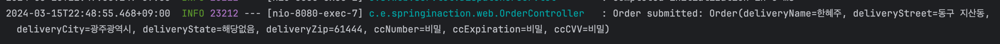
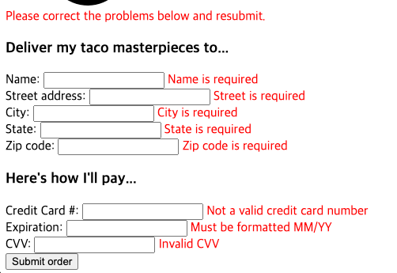
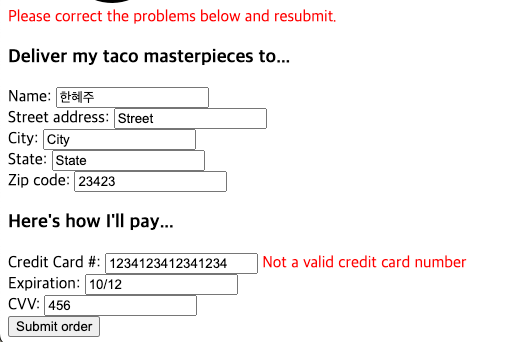
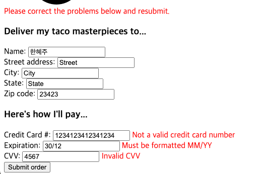

### 2. 웹 애플리케이션 개발하기
```@Data``` : 소스 코드에 누락된 final 속성들을 초기화하는 생성자는 물론이고, 속성들의 게터와 세터 등을 생성하라고 Lombok에 알려준다.  
```@Slf4j``` : 컴파일 시에 Lombok에 제공되며, 해당 클래스에 자동으로 SLF4J Logger를 생성한다. 이 애노테이션은 아래와 같은 코드를 추가한 것과 같은 효과를 준다.  
```
private static final org.slf4j.Logger log = 
    org.slf4j.LoggerFactory.getLogger(DesignTacoController.class);
```
  
```@Controller``` : 해당 클래스가 컨트롤러로 식별되게 하며, 컴포넌트 검색을 해야 한다는 것을 나타낸다. 따라서, 스프링이 클래스를 찾은 후 스프링 애플리케이션 컨텍스트의 빈으로 해당 클래스의 인스턴스를 자동 생성한다.  
```@RequestMappnig``` : 이 애노테이션이 클래스 수준으로 적용될 때는 해당 컨트롤러가 처리하는 요청의 종류를 나타낸다.  
```@GetMapping``` : HTTP GET 요청이 수신될 때 그 요청을 처리하기 위해 메서드가 호출됨을 나타낸다.  
이 외에도 ```@PostMapping```, ```@PutMapping```, ```@DeleteMapping```, ```@PatchMapping```이 존재한다.

```@Valid``` : 제출된 객체의 유효성 검사를 수행하도록 스프링 MVC에 알려준다.

=====  

**컨트롤러**는 스프링 MVC 프레임워크의 중심적인 역할을 수행한다.  
HTTP 요청을 처리하고, 브라우저에 보여줄 HTML을 뷰에 요청하거나, 또는 REST 형태의 응답 몸체에 직접 데이터를 추가한다.

=====

*```RequiredArgsConstructor``` 사용할 때 , not initialized in the default constructor 에러 발생*  
lombok 추가 시, gradle 버전이 달라서 발생하는 문제로 build.gradle 파일에서 아래와 같이 lombok을 추가하여 해결할 수 있다.
```
compileOnly 'org.projectlombok:lombok'
annotationProcessor 'org.projectlombok:lombok'
```


유효성 검사를 하는 한 가지 방법으로 메서드에 수많은 if/then 블록을 너저분하게 추가하는 것이 있다. 하지만, 이 방법은 무척 번거롭고 코드 파악과 디버깅이 어렵다.  
-> 스프링은 자바의 빈 유효성 검사 API를 지원한다.
**Hibernate** 컴포넌트는 스프링 부트의 웹 스타터 의존성으로 자동 추가되는데, 이를 통해 추가 코드 없이 쉽게 유효성 검사를 수행할 수 있다.

=====

2.2 테스트
  


2.3 유효성 테스트  
  
  
  