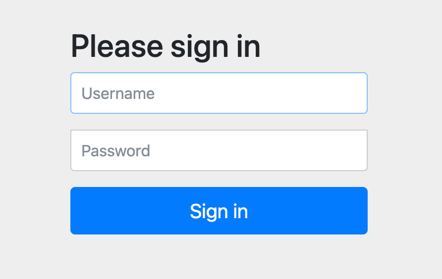

### 스프링 시큐리티  
스프링 시큐리티를 빌드 파일에 추가만 했을 때 아래 보안 구성이 제공된다.
- 모든 HTTP 요청 경로는 인증되어야 한다.
- 어떤 특정 역할이나 권한이 없다.
- 로그인 페이지가 따로 없다.
- 스프링 시큐리티의 HTTP 기본 인증을 사용해서 인증된다.
- 사용자는 하나만 있으며, 이름은 user, 비밀번호는 암호화해 준다.
  
  
[ 스프링 시큐리티의 HTTP 인증 대화상자 ]  




최소한 아래 기능을 할 수 있도록 스프링 시큐리티를 구성해야 한다.
- 스프링 시큐리티의 HTTP 인증 대화상자 대신 우리의 로그인 페이지로 인증한다.
- 다수의 사용자를 제공하며, 새로운 고객이 사용자로 등록할 수 있는 페이지가 있어야 한다.
- 서로 다른 HTTP 요청 경로마다 서로 다른 보안 규칙을 적용한다. 예를 들어, 홈페이지와 사용자 등록 페이지는 인증이 필요하지 않다.


**[ 변경 사항 ]**  
실습에서 사용된 ```WebSecurityConfigurerAdapter``` 지원 중단  

변경 전: SecurityConfig
```
@Configuration
@EnableWebSecurity
public class SecurityConfig extends WebSecurityConfigurerAdapter {
    @Override
    protected void configure(HttpSecurity http) throws Exception {
        http.authorizeRequests()
                .antMatchers("/design", "/orders")
                .access("hasRole('ROLE_USER')")
                .antMatchers("/", "/**").access("permitAll")
                .and().httpBasic();
    }
    
    @Override
    public void configure(AuthenticationManagerBuilder auth) throws Exception {
        auth.inMemoryAuthentication()
                .withUser("user1")
                .password("{noop}password1")
                .authorities("ROLE_USER")
                .and()
                .withUser("user2")
                .password("{noop}password2")
                .authorities("ROLE_USER");
    }
}
```

  

변경 후 : SecurityConfig
```
@Configuration
@EnableWebSecurity
public class SecurityConfig {

    @Bean
    public SecurityFilterChain filterChain(HttpSecurity http) throws Exception {
        http
                .authorizeHttpRequests(authorize -> authorize
                        .requestMatchers("/design", "/orders").hasRole("USER")
                        .requestMatchers("/", "/**").permitAll()
                ).httpBasic(withDefaults());

        return http.build();
    }

    @Bean
    public UserDetailsService userDetailsService() {
        PasswordEncoder encoder = PasswordEncoderFactories.createDelegatingPasswordEncoder();

        UserDetails user1 = User.withUsername("user1")
                .password(encoder.encode("password1"))
                .roles("USER")
                .build();

        UserDetails user2 = User.withUsername("user2")
                .password(encoder.encode("password2"))
                .roles("USER")
                .build();

        return new InMemoryUserDetailsManager(user1, user2);
    }

}
```